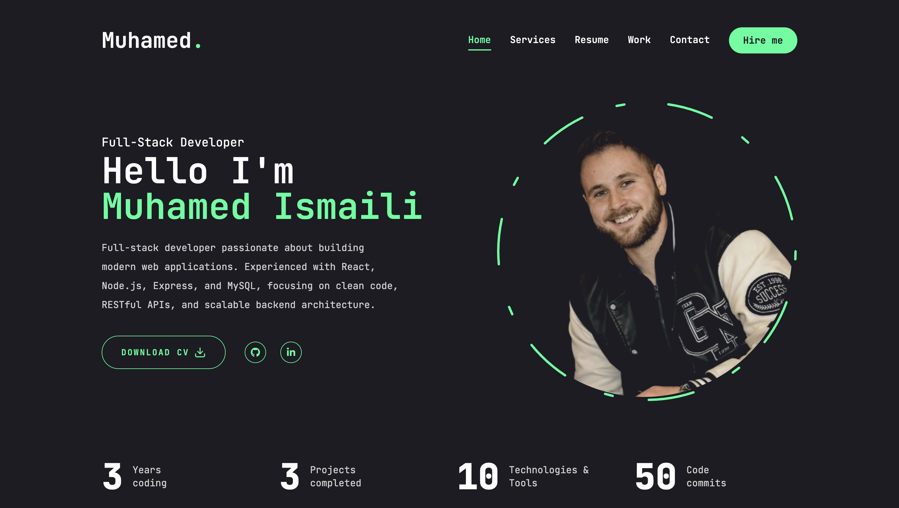
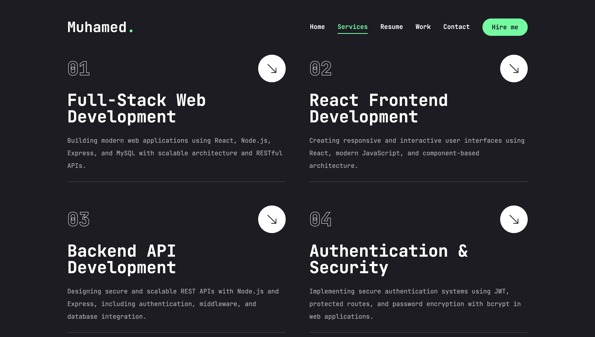
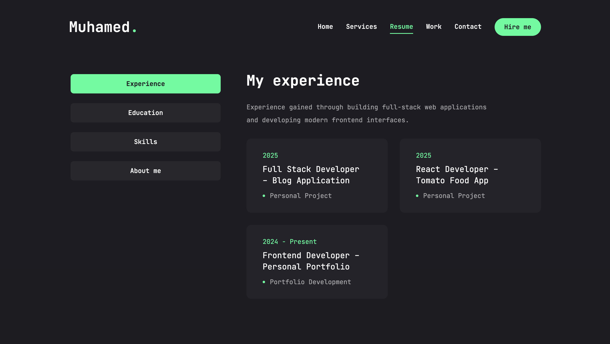
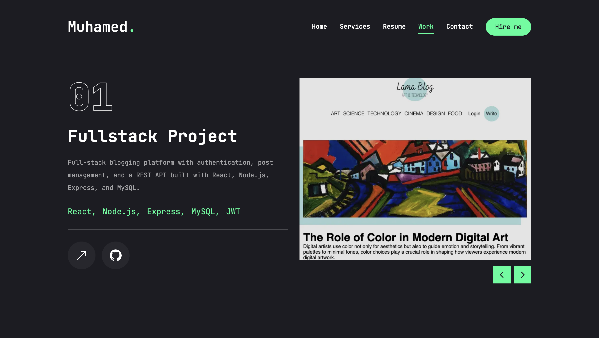
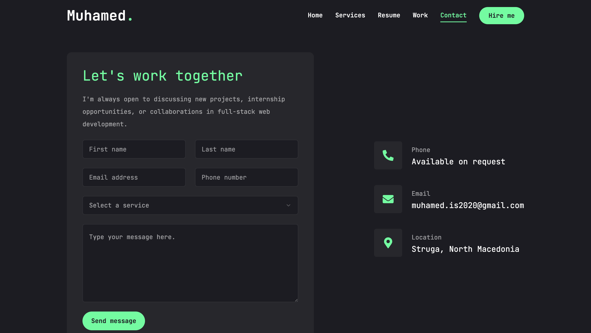

# 🌐 Personal Portfolio – Developer Portfolio Website

A modern developer portfolio built with **Next.js, React, and Tailwind CSS**.  
The website showcases projects, technical skills, and experience through a responsive and animated user interface.

🔗 **Live Demo:** https://portfolio-chi-seven-80.vercel.app  
📂 **Repository:** https://github.com/muhamedismaili/Portfolio  

---

## 🚀 Overview

This portfolio website presents my work as a **full-stack developer**, highlighting projects, technical skills, and contact information in a clean and interactive layout.

The site is designed to provide recruiters and collaborators with a quick overview of:

- My projects and technical work  
- My development skills and technologies  
- My experience and education  
- Ways to contact me for opportunities  

The portfolio focuses on **clean UI design, smooth animations, and responsive layouts**.

---

## 🛠 Tech Stack

### Frontend
- Next.js  
- React  
- JavaScript (ES6+)  
- Tailwind CSS  

### UI & Animation
- Framer Motion  
- React Icons  
- React CountUp  

### Deployment
- Vercel

---

## ✨ Key Features

- Fully responsive portfolio design  
- Smooth page transitions and animations  
- Interactive project showcase  
- Skills and technology display  
- Animated statistics section  
- Resume and experience section  
- Contact form for direct communication  

---

## 🧠 Architecture

The portfolio follows a **component-based architecture using Next.js App Router**.

### Structure

- Reusable UI components  
- Page-based routing with Next.js  
- Modular layout structure  
- Tailwind utility-based styling  

### Performance

- Optimized assets and images  
- Fast static rendering using Next.js  
- Lightweight component structure  

---

## 📸 Screenshots

### Home Page


Displays introduction, developer role, and animated statistics.

---

### Services Section


Highlights development services and core technical expertise.

---

### Resume Section


Shows education, experience, and technical skills.

---

### Projects Section


Displays portfolio projects with live demo and repository links.

---

### Contact Page


Allows users to contact me directly through a form.

---

## ⚙️ Installation & Setup

Clone the repository and run the project locally.

```bash
git clone https://github.com/muhamedismaili/Portfolio.git
cd Portfolio
```

Install dependencies:

```bash
npm install
```

Run development server:

```bash
npm run dev
```

Build for production:

```bash
npm run build
```

---

## 📈 What This Project Demonstrates

- Modern frontend development with Next.js  
- Component-based React architecture  
- Responsive design using Tailwind CSS  
- UI animation and page transitions  
- Clean portfolio presentation for developers  
- Deployment workflow using Vercel  

---

## 👨‍💻 Author

**Muhamed Ismaili**  
Computer Science & Engineering – UIST Ohrid  

📧 muhamed.is2020@gmail.com  
🔗 https://www.linkedin.com/in/muhamed-ismaili-4bb8343a9/

---

## 📄 License

Developed for educational and portfolio purposes.